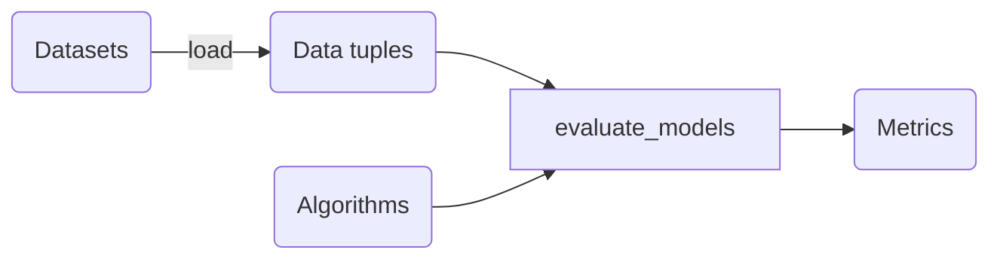

# EthicML: A featureful framework for developing fair algorithms

[](http://mypy-lang.org/)


EthicML is a library for performing and assessing __algorithmic fairness__.
Unlike other libraries, EthicML isn't an education tool, but rather a __researcher__'s toolkit.

Other algorthimic fairness packages are useful, but given that we primarily do research,
a lot of the work we do doesn't fit into some nice box.
For example, we might want to use a 'fair' pre-processing method on the data before training a classifier on it.
We may still be experimenting and only want part of the framework to execute,
or we may want to do hyper-parameter optimization.
Whilst other frameworks can be modified to do these tasks,
you end up with hacked-together approaches that don't lend themselves to be built on in the future.
Because of this, we built EthicML, a fairness toolkit for researchers.

Features include:
- Support for multiple sensitive attributes
- Vision datasets
- Codebase typed with mypy
- Tested code
- Reproducible results

### Why not use XXX?

There are an increasing number of other options,
IBM's fair-360, Aequitas, EthicalML/XAI, Fairness-Comparison and others.
They're all great at what they do, they're just not right for us.
We will however be influenced by them.
Where appropriate, we even subsume some of these libraries.

## Installation

EthicML requires Python >= 3.8.
To install EthicML, just do
```
pip3 install ethicml
```

If you want to use the method by Agarwal et al., you have to explicitly install _all_ dependencies:
```
pip3 install 'ethicml[all]'
```
(The quotes are needed in `zsh` and will also work in `bash`.)

**Attention**: In order to use all features of EthicML, PyTorch needs to be installed separately.
We are not including PyTorch as a requirement of EthicML,
because there are many different versions for different systems.

## Documentation

The documentation can be found here: https://wearepal.ai/EthicML/

## Design Principles



Keep things simple.

### The Triplet

Given that we're considering fairness, the base of the toolbox is the triplet {x, s, y}

- X - Features
- S - Sensitive Label
- Y - Class Label

__Developer note__: All methods must assume S and Y are multi-class.

We use a DataTuple class to contain the triplet

```python
triplet = DataTuple(x: pandas.DataFrame, s: pandas.DataFrame, y: pandas.DataFrame)
```

In addition, we have a variation: the TestTuple which contains the pair
```python
pair = TestTuple(x: pandas.DataFrame, s: pandas.DataFrame)
```
This is to reduce the risk of a user accidentally evaluating performance on their training set.

Using dataframes may be a little inefficient,
but given the amount of splicing on conditions that we're doing, it feels worth it.

### Separation of Methods

We purposefully keep pre, during and post algorithm methods separate. This is because they have different return types.

```python
pre_algorithm.run(train: DataTuple, test: TestTuple)  # -> Tuple[DataTuple, TestTuple]
in_algorithm.run(train: DataTuple, test: TestTuple)  # -> Prediction
post_algorithm.run(train_prediction: Prediction, train: DataTuple, test_prediction: Prediction, test: TestTuple)  # -> Prediction
```
where `Prediction` holds a pandas.Series of the class label.
In the case of a "soft" output, `SoftPrediction` extends `Prediction` and provides a mapping from
"soft" to "hard" labels.
See the documentation for more details.

### General Rules of Thumb

- Mutable data structures are bad.
- At the very least, functions should be Typed.
- Readability > Efficiency.
- Warnings must be addressed.
- Always write tests first.

## Future Plans

The aim is to make EthicML operate on 2 levels.

1. We want a high-level API so that a user can define a new model or metric, then get publication-ready
results in just a couple of lines of code.
2. We understand that truly ground-breaking work sometimes involves tearing up the rulebook.
Therefore, we want to also expose a lower-level API so that a user can make use of as much, or little of the library
as is suitable for them.

We've built everything with this philosophy in mind, but acknowledge that we still have a way to go.

# Contributing

If you're interest in this research area, we'd love to have you aboard.
For more details check out [CONTRIBUTING.md](./CONTRIBUTING.md).
Whether your skills are in coding-up papers you've read, writing tutorials, or designing a logo, please reach out.

## Development
Install development dependencies with `pip install -e .[dev]`

To use the pre-commit hooks run `pre-commit install`
